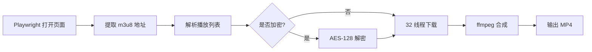

# JableTV Downloader | JableTV 下载器

> **Fork** of [hcjohn463/JableTVDownload](https://github.com/hcjohn463/JableTVDownload) — 大量 Bug 修复与功能增强 / Significant rewrites and bug fixes.

[](LICENSE)

---

## 简介 | Introduction

JableTV 高速并行下载工具，基于 Playwright 提取 m3u8 流地址，32 线程并行下载 TS 片段，AES-128 解密，ffmpeg 无损合成 MP4。

Fast multi-threaded JableTV video downloader. Extracts m3u8 via Playwright, downloads TS segments in 32 parallel threads, decrypts AES-128 if needed, and assembles into a single MP4 without re-encoding.

---

## 功能特点 | Features

- 🚀 **32 线程并行下载** — 跑满带宽 / Maxes out your bandwidth
- 🔄 **自动重试** — 失败片段自动重下 / Failed segments retry automatically
- 🔐 **AES-128 解密** — 支持加密流 / Handles encrypted streams
- 📊 **实时进度条** — tqdm 显示下载与合成进度 / Real-time progress via tqdm
- 🎬 **快速合成** — ffmpeg `-c copy` 不重编码 + `faststart` / Lossless concat with instant streaming
- 🧹 **自动清理** — 合并后自动删除临时片段 / Auto-cleanup after merge
- 🔌 **路径自动检测** — playwright-cli 自动定位，无需手动配置 / Auto-detect playwright-cli path

---

## 前置依赖 | Prerequisites

| 依赖 | 说明 |
|:-----|:-----|
| Python 3.8+ | 运行环境 |
| [ffmpeg](https://ffmpeg.org/) | 合成 MP4（需加入 PATH） |
| Node.js | 运行 Playwright |
| npm 全局包 | `npm install -g @playwright/cli` |
| Playwright 浏览器 | `npx playwright install chromium` |

---

## 安装 | Installation

```bash
# 克隆仓库
git clone https://github.com/rmtd418/jabletv-downloader.git
cd jabletv-downloader

# 安装 Python 依赖（建议先建 venv）
pip install -r requirements.txt

# 安装 Playwright
npm install -g @playwright/cli
npx playwright install chromium
```

### 创建虚拟环境（可选但推荐）

```bash
python -m venv venv
# Windows
venv\Scripts\activate
# Linux / macOS
source venv/bin/activate
pip install -r requirements.txt
```

---

## 使用方法 | Usage

```bash
# 基础用法 — 下载到 ./output/番号/番号.mp4
python jable_fast.py https://jable.tv/videos/adn-758/

# 自定义输出路径
python jable_fast.py https://jable.tv/videos/ipx-486/ -o D:/downloads
```

### 参数 | Options

```
usage: jable_fast.py [-h] [-o OUTPUT] url

positional arguments:
  url                   JableTV 影片网址 / Video URL

options:
  -h, --help            显示帮助 / Show help
  -o, --output OUTPUT   输出目录（默认 ./output/番号/）/ Output directory
```

### 输出结构 | Output structure

```
jabletv-downloader/
└── output/
    ├── adn-758/
    │   └── adn-758.mp4      ← 下载结果
    └── ipx-486/
        └── ipx-486.mp4
```

---

## 运行流程 | How it works



1. **Playwright** 打开视频页，提取 m3u8 地址
2. **m3u8 解析** 获取所有 TS 片段地址和加密密钥
3. **32 线程并行下载** 同时拉取所有片段
4. **ffmpeg concat demuxer** 无损合成 MP4
5. **自动清理** 删除临时片段

---

## 项目结构 | Project structure

```
├── jable_fast.py    # 主入口 — CLI 参数解析 + 流程编排
├── crawler.py       # 多线程下载引擎 + 自动重试
├── merge.py         # ffmpeg concat 清单生成
├── encode.py        # ffmpeg 封装 + tqdm 进度
├── delete.py        # 临时文件清理
├── config.py        # HTTP 请求头
├── requirements.txt # Python 依赖
├── CHANGELOG.md     # 更新日志
└── LICENSE          # Apache 2.0
```

---

## 与原版差异 | Differences from upstream

本 Fork 修复了原项目中的多个稳定性和正确性问题：

| 修复项 | 原版行为 | 本 Fork |
|:-------|:---------|:--------|
| 文件写入模式 | `ab`（追加）— 重跑时损坏片段 | `wb`（覆写）— 始终干净 |
| 残留片段处理 | 跳过已有文件 — 复用损坏数据 | 启动时清理旧片段 |
| AES IV 解码 | `[:16].encode()` — IV 字节错误 | `bytes.fromhex()` — 正确 16 字节 IV |
| 输出文件已存在 | 直接 return — 阻止重下 | 删除后重新下载 |
| Playwright 路径 | 硬编码单机路径 | 自动检测 PATH/npm |
| 输出目录 | 固定当前目录 | `--output` / `-o` 参数 |
| Python 依赖 | 11 个（含未使用的 bs4、selenium） | 4 个（最小化） |
| 冗余代码 | Docker / K8s / ChromeDriver | 已移除 |
| 浏览器泄漏 | 每次下载开新 Chrome 永不关 | `finally` 精确关闭，零泄漏 |
| pw() 超时 | 30s 固定，慢网必崩 | 120s + Cloudflare 轮询自适应 |
| m3u8 下载 | `urlretrieve` 无超时可永久卡死 | `requests.get(timeout=15)` 安全限时 |
| 删除权限 | 文件被锁直接崩 | `try/except PermissionError` 优雅跳过 |

---

## 更新日志 | Changelog

详见 [CHANGELOG.md](CHANGELOG.md) / See [CHANGELOG.md](CHANGELOG.md) for detailed release notes.

---

## 许可证 | License

本项目基于 Apache License 2.0 — 详见 [LICENSE](LICENSE)。

This project is licensed under the Apache License 2.0 — see the [LICENSE](LICENSE) file for details.

Original work copyright (c) 2021-2023 hcjohn463  
Modified work copyright (c) 2026 rmtd418
