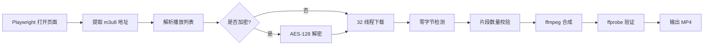

# JableTV Downloader | JableTV 下载器

> **Fork** of [hcjohn463/JableTVDownload](https://github.com/hcjohn463/JableTVDownload) — 大量 Bug 修复与功能增强 / Significant rewrites and bug fixes.

[](LICENSE)

---

## 简介 | Introduction

JableTV 高速并行下载工具，基于 Playwright 提取 m3u8 流地址，32 线程并行下载 TS 片段，AES-128 解密，ffmpeg 无损合成 MP4，全程完整性验证。

Fast multi-threaded JableTV video downloader. Extracts m3u8 via Playwright, downloads TS segments in 32 parallel threads, decrypts AES-128 if needed, and assembles into a single MP4 with full integrity verification.

---

## 功能特点 | Features

- 🚀 **32 线程并行下载** — 跑满带宽 / Maxes out your bandwidth
- 🔄 **自动重试** — 失败片段自动重下 / Failed segments retry automatically
- 🔐 **AES-128 解密** — 支持加密流 / Handles encrypted streams
- 📊 **实时进度条** — tqdm 显示下载与合成进度 / Real-time progress via tqdm
- 🎬 **快速合成** — ffmpeg `-c copy` 不重编码 / Lossless concat with instant streaming
- 📦 **排队批量下载** — 一次丢多部，浏览器只开一次，自动排队 / Batch queue with shared browser session
- ✅ **下载验证** — 零字节片段检测 + 片段数量核对 / Zero-byte detection + segment count check
- ✅ **合成验证** — ffprobe 检查视频流、音频流、时长 / ffprobe checks video, audio, duration
- 🧹 **自动清理** — 保留最终文件，安全删除临时片段 / Safe cleanup, preserves final output
- 🔌 **路径自动检测** — playwright-cli 自动定位，无需手动配置 / Auto-detect playwright-cli path

---

## 安装 | Installation

```bash
git clone https://github.com/rmtd418/jabletv-downloader.git
cd jabletv-downloader
pip install -r requirements.txt
npm install -g @playwright/cli
npx playwright install chromium
```

---

## 使用方法 | Usage

```bash
# 基础用法 — 下载到 ./output/番号/番号.mp4
python jable_fast.py https://jable.tv/videos/adn-758/

# 自定义输出路径
python jable_fast.py https://jable.tv/videos/ipx-486/ -o D:/downloads

# 排队批量下载（浏览器只开一次，一部接一部）
python jable_fast.py https://jable.tv/videos/adn-758/ https://jable.tv/videos/ipx-486/ https://jable.tv/videos/ssis-927/
```

### 参数 | Options

```
usage: jable_fast.py [-h] [-o OUTPUT] url

positional arguments:
  url                   JableTV 影片网址 / Video URL

options:
  -h, --help            显示帮助 / Show help
  -o, --output OUTPUT   输出目录（默认 ./output/番号/）/ Output directory
```

---

## 运行流程 | How it works



1. **Playwright** 打开视频页，提取 m3u8 地址（Cloudflare 轮询等待，最长 30s）
2. **m3u8 解析** 获取全部 TS 片段地址和加密密钥
3. **32 线程并行下载** 同时拉取所有片段，单个失败自动重试
4. **零字节检测** 发现空文件自动标记重下
5. **片段数量校验** 对比实际下载数与 m3u8 声明数
6. **ffmpeg concat demuxer** 无损合成 MP4
7. **ffprobe 验证** 检查视频流、音频流、时长偏差 < 60s
8. **自动清理** 保留最终 mp4，删除临时文件

---

## 项目结构 | Project structure

```
├── jable_fast.py    # 主入口 — CLI 参数 + 流程编排 + 完整性验证
├── crawler.py       # 多线程下载引擎 + 自动重试 + 零字节检测
├── merge.py         # ffmpeg concat 清单生成
├── encode.py        # ffmpeg 封装 + tqdm 进度
├── delete.py        # 安全清理（保留最终文件）
├── config.py        # HTTP 请求头
├── requirements.txt # Python 依赖
├── CHANGELOG.md     # 更新日志
└── LICENSE          # Apache 2.0
```

---

## 与原版差异 | Differences from upstream

本 Fork 修复了原项目中的多个稳定性和正确性问题：

| 修复项 | 原版行为 | 本 Fork |
|:-------|:---------|:--------|
| 文件写入模式 | `ab`（追加）— 重跑时损坏片段 | `wb`（覆写）— 始终干净 |
| 残留片段处理 | 跳过已有文件 — 复用损坏数据 | 启动时清理旧片段 |
| AES IV 解码 | `[:16].encode()` — IV 字节错误 | `bytes.fromhex()` — 正确 16 字节 IV |
| 输出文件已存在 | 直接 return — 阻止重下 | 删除后重新下载 |
| Playwright 路径 | 硬编码单机路径 | 自动检测 PATH/npm |
| 输出目录 | 固定当前目录 | `--output` / `-o` 参数 |
| Python 依赖 | 11 个（含未使用的 bs4、selenium） | 4 个（最小化） |
| 冗余代码 | Docker / K8s / ChromeDriver | 已移除 |
| 浏览器泄漏 | 每次下载开新 Chrome 永不关 | `finally` 精确关闭，零泄漏 |
| pw() 超时 | 30s 固定，慢网必崩 | 120s + Cloudflare 轮询自适应 |
| m3u8 下载 | `urlretrieve` 无超时可永久卡死 | `requests.get(timeout=15)` 安全限时 |
| 删除权限 | 文件被锁直接崩 | `try/except PermissionError` 优雅跳过 |
| 零字节片段 | 无检测 — 空文件混入合并 | 下载后立即检查，自动重试 |
| 片段数量 | 不校验 | 合成前比对 m3u8 声明数 |
| 合成后验证 | 无 | ffprobe 检查视频流/音频流/时长 |
| 批量下载 | 不支持 | 多个 URL 排队自动下，浏览器复用 |
| 浏览器断线 | 死透 | `ensure_browser()` 自动检测重连 |

---

## 更新日志 | Changelog

详见 [CHANGELOG.md](CHANGELOG.md) / See [CHANGELOG.md](CHANGELOG.md) for detailed release notes.

---

## 许可证 | License

本项目基于 Apache License 2.0 — 详见 [LICENSE](LICENSE)。

This project is licensed under the Apache License 2.0 — see the [LICENSE](LICENSE) file for details.

Original work copyright (c) 2021-2023 hcjohn463  
Modified work copyright (c) 2026 rmtd418
