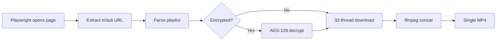

# JableTV Downloader

> **Fork** of [hcjohn463/JableTVDownload](https://github.com/hcjohn463/JableTVDownload) — significant rewrites and bug fixes.

[](LICENSE)

Fast multi-threaded JableTV video downloader powered by Playwright + ffmpeg.

Extracts the m3u8 stream URL via Playwright, downloads all TS segments in parallel (32 threads), decrypts AES-128 if needed, and assembles them into a single MP4 — all without re-encoding.

## Features

- 🚀 **32-thread parallel download** — maxes out your bandwidth
- 🔄 **Auto-retry** — failed segments are retried automatically
- 🔐 **AES-128 decryption** — handles encrypted streams
- 📊 **Real-time progress** — tqdm progress bars for download & encoding
- 🎬 **Fast concat** — `ffmpeg -c copy` with `+faststart` for instant streaming
- 🧹 **Auto-cleanup** — segment files removed after successful merge
- 🔌 **Auto-detect** — playwright-cli location auto-detected, no manual config

## Prerequisites

- Python 3.8+
- [ffmpeg](https://ffmpeg.org/) (in PATH)
- Node.js + `npm install -g @playwright/cli`
- Playwright browsers: `npx playwright install chromium`

## Installation

```bash
git clone https://github.com/YOUR_USERNAME/jabletv-downloader.git
cd jabletv-downloader
pip install -r requirements.txt
```

## Usage

```bash
# Basic — downloads to ./output/<video-id>/<video-id>.mp4
python jable_fast.py https://jable.tv/videos/adn-758/

# Custom output directory
python jable_fast.py https://jable.tv/videos/ipx-486/ -o D:/downloads
```

### Options

```
usage: jable_fast.py [-h] [-o OUTPUT] url

positional arguments:
  url                   JableTV video URL (https://jable.tv/videos/xxx/)

options:
  -h, --help            show this help message and exit
  -o, --output OUTPUT   output directory (default: ./output/<video-id>/)
```

## How it works



1. **Playwright** opens the video page and extracts the m3u8 URL
2. **m3u8 parser** reads the playlist to get all TS segment URLs + encryption keys
3. **32-thread parallel downloader** fetches all segments at once
4. **ffmpeg concat demuxer** stitches segments into MP4 without re-encoding
5. **Cleanup** removes temporary segment files

## Project structure

```
├── jable_fast.py    # Main entry point — CLI argument parsing + orchestration
├── crawler.py       # Multi-threaded segment downloader with retry
├── merge.py         # ffmpeg concat list generator
├── encode.py        # ffmpeg wrapper with tqdm progress
├── delete.py        # Temporary file cleanup
├── config.py        # HTTP request headers
├── requirements.txt # Python dependencies
└── LICENSE          # MIT License
```

## Differences from upstream

This fork addresses several stability and correctness issues found in the original:

| Fix | Original | This fork |
|:----|:---------|:----------|
| File write mode | `ab` (append) — corrupts on re-run | `wb` (overwrite) — always clean |
| Stale segment handling | Skipped existing files — reused corrupted data | Cleans old segments before download |
| AES IV decoding | `[:16].encode()` — wrong IV bytes | `bytes.fromhex()` — correct 16-byte IV |
| Output file exists | Early return — blocked re-download | Deletes and re-downloads |
| Playwright path | Hardcoded to one machine | Auto-detected from PATH/npm |
| Output directory | Fixed to CWD | `--output` / `-o` flag |
| Dependencies | 11 (incl. unused bs4, selenium) | 4 (minimal) |
| Docker / K8s / ChromeDriver | Bundled | Removed (out of scope) |

## Changelog

See [CHANGELOG.md](CHANGELOG.md) for detailed release notes.

## License

This project is licensed under the Apache License 2.0 — see the [LICENSE](LICENSE) file for details.

Original work copyright (c) 2021-2023 hcjohn463  
Modified work copyright (c) 2026 rmtd418
